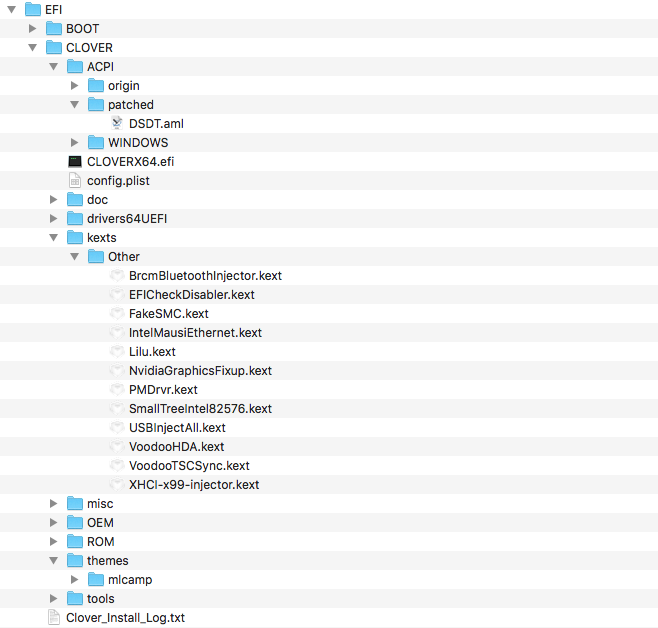

# X99DeluxeII
All my files (including 3rd party work) for **X99 Deluxe II** based hack. Works great.

Currenly used Clover version: **Clover_v2.4k_r4411** [clover](https://sourceforge.net/projects/cloverefiboot/)

## **Setup:**
- Asus X99 Deluxe II Rev 1.02 [asus](https://www.asus.com/us/Motherboards/X99-DELUXE-II/)
- i7 5820K 3.3Ghz > O.C. 4.2Ghz
- nVidia 1080 Ti (nVidia WEB Drivers)
- G.Skill Trident Z RGB 64GB 3200Mhz > O.C. 3600MHZ
- Seasonic Prime Titanium 850W
- Samsung 960 PRO 512GB
- Samsung 850 EVO 250G
- Seagate FireCuda Laptop SSHD 2TB
- macOS version - **10.13.3 (17D102)** patches for **10.13.4** beta included

## **Drivers & Patches**

**EFI**
- apfs.efi
- AptioMemoryFix.efi

**Audio:**
- VoodooHDA 2.8.9 - works great, only HDMI/DisplayPort audio sometimes...

**ACPI Tables:**
- custom DSDT

**USB***
- XHCI-x99-injector.kext

**Network:**
- WiFi - OOB - both 2.5 & 5.0Ghz
- BT - BrcmBluetoothInjector.kext [repo](https://github.com/the-darkvoid/BrcmPatchRAM)
- Intel® I218V - IntelMausiEthernet.kext [repo](https://github.com/Mieze/IntelMausiEthernet)
- Intel® I211-A - SmallTreeIntel82576.kext
- Bluetooth - BrcmBluetoothInjector.kext

**XCPM**
- kernel patches for Haswell-E
- scope for Asus MSR locked MSR
- Haswell-E PMDrvr.kext for better states
- Vectors through - freqVectorsEdit.sh [repo](https://github.com/Piker-Alpha/freqVectorsEdit.sh)

**GPU**
- nVidia WEB drivers (script for download included)
- NvidiaGraphicsFixup.kext - for boot problems (requires Lilu.kext)

**NVMe**
- native macOS 10.13.+ support

## **BIOS Settings:**
- Overclock - 1.3V CPU, 40 ratio limit
- CMS - Disabled
- Secure Boot - Other OS

## **System Services**
**iMessage and iCloud services:**
use iMessageDebug for extract ROM and MLB(Board Serial Number) from
"real" Mac machine then insert your numbers to config.plist
**Never install OS with those numbers** otherwise Apple will block them
and you will have to call Apple support (and that is horrible thing trust me).
